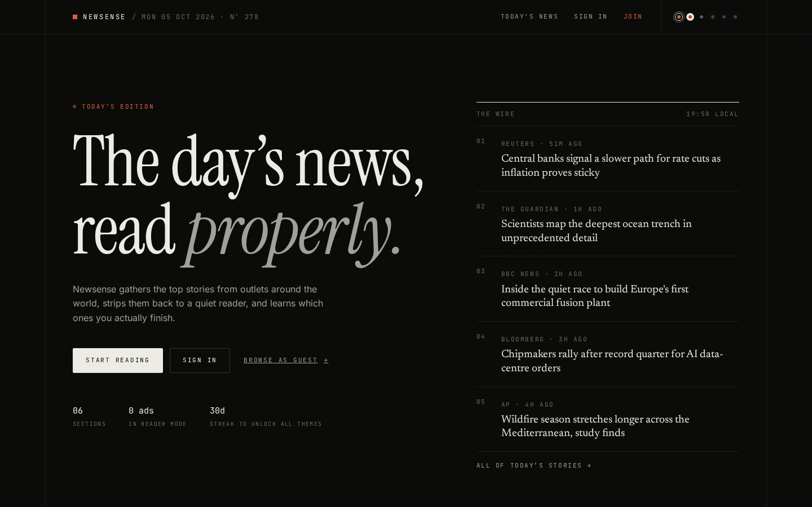
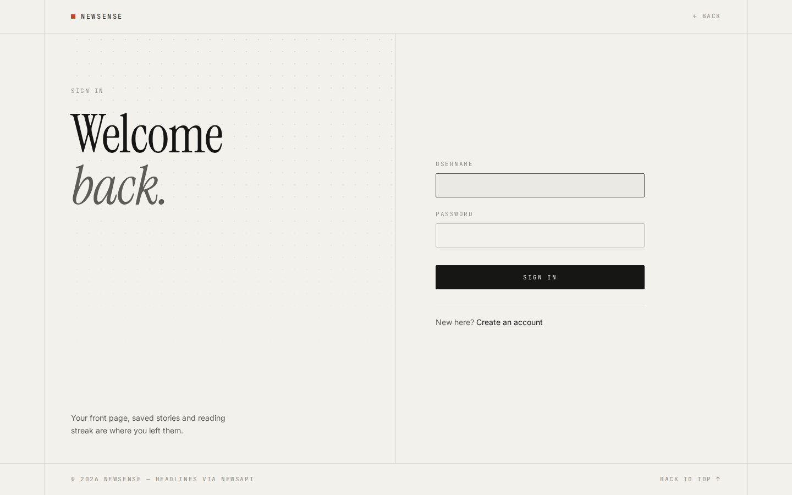

<h1 align="center">Newsense</h1>

<p align="center">
  A personalised news reader. Top headlines from around the world, a clean
  reader mode, and a front page that learns what you actually read.
</p>

<p align="center">
  <a href="https://news-app-3x77.onrender.com/"><strong>Open the live site →</strong></a>
</p>

<p align="center">
  
  
  
  
</p>

<p align="center">
  
</p>

> **Heads up:** the live site runs on Render's free plan, which goes to sleep
> after 15 minutes without visitors. If it's been idle, the first page can take
> about a minute to load. After that it's quick.

---

## Features

| | |
|---|---|
| **Personal front page** | Recommendations shaped by the stories you open and finish, with a match score and a tone label (positive, neutral or negative, from sentiment analysis) on each one. |
| **Reader mode** | Every article opens as clean text in a reading layout. No pop-ups, autoplay or cookie walls. |
| **Search and sections** | Search today's headlines by keyword, or browse Business, Entertainment, Health, Science, Sports and Technology. |
| **Saved stories** | Bookmark anything to read later, from the front page or the reader. |
| **History and stats** | See everything you've read, plus your reading streak, busiest day, peak hour and favourite sections. |
| **Streak themes** | Dark and Light from day one. Mono, Sunset, Ocean and Forest unlock as your daily reading streak grows (1, 7, 14 and 30 days). |
| **Guest mode** | Browse today's headlines without an account. |
| **Admin tools** | One admin account (set by `ADMIN_USERNAME`) gets user management, article and source stats, and a site-wide theme setting. Nobody else can be made an admin. |

<p align="center">
  
</p>

## Tech stack

- **Backend:** Python, Flask, Flask-Login, Flask-WTF (CSRF), SQLAlchemy with Flask-Migrate
- **Data:** [NewsAPI](https://newsapi.org) for headlines, BeautifulSoup for reader mode, scikit-learn and TextBlob for recommendations
- **Database:** Postgres in production ([Neon](https://neon.com)), SQLite locally
- **Frontend:** Server-rendered Jinja templates, one shared stylesheet (`static/design.css`), Chart.js on the stats page
- **Hosting:** [Render](https://render.com) web service, served by gunicorn

## Project structure

```
app.py                    Routes, NewsAPI calls, reader mode, stats
models.py                 Database models
recommendation_model.py   Recommendation engine
migrations/               Database migrations (Flask-Migrate / Alembic)
templates/                Jinja templates (admin pages in templates/admin/)
static/design.css         Design system: themes, type and shared components
static/stories.js         Story cards, saving, sharing and toasts
static/theme.js           Theme picker and streak-locked themes
render.yaml               Render deployment config
```

## Run it locally

You'll need Python 3.12 and a free API key from [newsapi.org](https://newsapi.org).

```bash
git clone https://github.com/akshajan-r/News-app.git
cd News-app
python -m venv venv
source venv/bin/activate          # Windows: venv\Scripts\activate
pip install -r requirements.txt

export NEWS_API_KEY=your-key      # Windows: set NEWS_API_KEY=your-key
flask --app app db upgrade
flask --app app run
```

Then open http://127.0.0.1:5000. Without `DATABASE_URL` set, the app uses a
local SQLite file at `instance/newsapp.db`.

### Environment variables

| Variable | Required | What it's for |
|---|---|---|
| `NEWS_API_KEY` | Yes | Fetching headlines from NewsAPI |
| `SECRET_KEY` | In production | Signs sessions and CSRF tokens. Defaults to `dev` locally. |
| `DATABASE_URL` | In production | Postgres connection string. Defaults to local SQLite. |
| `ADMIN_USERNAME` | No | The one account allowed to be an admin. Defaults to `aks`. |

## Deploy your own on Render (free)

Render's free web service wipes its disk whenever it restarts or goes to sleep,
so the database has to live somewhere else. Render's own free Postgres is
deleted after 30 days, so this uses a free [Neon](https://neon.com) database,
which doesn't expire.

1. **Create the database.** Sign up at neon.com, create a project, and copy its
   connection string (it starts with `postgresql://`).
2. **Create the service.** In the [Render dashboard](https://dashboard.render.com),
   choose **New → Blueprint**, connect this repo and pick the branch. Render
   reads `render.yaml` and asks for:
   - `NEWS_API_KEY`: your key from newsapi.org
   - `DATABASE_URL`: the Neon connection string
3. **Deploy.** Render installs the requirements and creates the tables during the
   build, then starts the site. `SECRET_KEY` is generated for you.
4. **Claim the admin account.** Sign up with the username set in `ADMIN_USERNAME`
   (`aks` unless you change it in `render.yaml`). That account is the only admin.

Every push to the deployed branch redeploys automatically.

**Free-plan limits:** the site sleeps after 15 idle minutes, and Neon's free
plan includes 0.5 GB of storage. NewsAPI's free Developer plan is intended for
development, so check its terms before sharing your deployment widely.

---

<p align="center">
  Headlines provided by <a href="https://newsapi.org">NewsAPI</a>.
</p>
